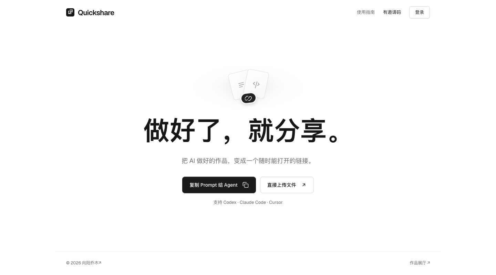

# Quickshare Agent

**中文** · [English](#english)

把 AI 做好的网页，变成一个可以持续更新的链接。



Quickshare 是给自己和朋友使用的发布服务。朋友把邀请 Prompt 发给 Agent，即可建立自己的发布空间；无需先注册，之后可以补设用户名和密码。网页、CLI 和 Agent 管理同一批内容。

这是从 [Quickshare](https://github.com/joeseesun/quickshare) 拆出的独立开发仓库，聚焦 Agent 发布和可安装服务。旧仓库与已有分享链接保持独立。

## 能做什么

- 发布 HTML、Markdown 和静态网站文件夹，默认凭链接访问，可选加入作品展厅。
- 自动分配独立地址；改标题、改账号和更新内容都保留原来的链接。
- 幂等发布、版本冲突保护、历史恢复、下架和重新发布。
- 复制 Prompt 连接 Codex、Claude Code、Cursor 等能执行命令的 Agent。
- Agent 查询自身身份、权限和配额，管理网站、分享信息、账号与密码；管理员还可管理邀请和朋友。
- 按需添加 OG / 社交分享信息和 SEO 设置。原始 HTML 默认原样输出，不加水印、署名或推广。

## 部署状态

| 方式 | 当前状态 | 数据保存方式 |
| --- | --- | --- |
| Docker Compose | 已通过容器创建、发布和重建验收 | 持久卷中的 SQLite + 私有文件目录 |
| Node.js 24+ / VPS | 当前运行方式 | SQLite / libSQL + 文件目录 / S3 |
| Cloudflare Workers | 规划中，尚不可一键安装 | 计划 D1 + R2 |
| Vercel | 规划中，尚不可一键安装 | 计划托管数据库 + 对象存储 |

[存储配置与旧数据迁移](docs/storage.md) · [多平台实施方案](docs/portable-deployment.md)。云端存储和上传适配通过独立验收后才添加部署按钮。

## 快速开始：Docker

需要 Docker 和 Compose v2，不需要本地 Node.js。

```sh
git clone https://github.com/joeseesun/quickshare-agent.git
cd quickshare-agent

docker run --rm --user "$(id -u):$(id -g)" \
  -v "$PWD:/workspace" -w /workspace \
  node:24.20.0-bookworm-slim node scripts/setup.js --docker

docker compose --env-file .env.docker up -d --build --wait
```

打开 <http://127.0.0.1:8090>，运行以下命令获取五分钟有效的一次性管理员登录链接：

```sh
docker compose --env-file .env.docker exec -T quickshare \
  node bin/quickshare.js dashboard --url http://127.0.0.1:3000
```

登录后设置自己的账号和密码，或直接创建朋友邀请。没有统一默认密码；`.env.docker` 中的管理员密钥请私密保管。

[完整 Docker 说明：HTTPS、配置、备份和升级](DOCKER_INSTALL.md)。实例部署到公网时必须设置正确的 HTTPS `BASE_URL` 并配置 TLS。

<details>
<summary>使用 Node.js 开发</summary>

```sh
npm ci
npm run setup
npm start
```

需要 Node.js 24+，访问 <http://127.0.0.1:3000>。`.env` 与 Docker 配置分开保存。

</details>

## 在 Agent 对话中发布

打开你自己部署实例的首页，复制 Prompt 给 Agent。它读取该实例的 `/skill.md`，安装 CLI，兑换邀请或连接码，将个人凭据保存在本地私密配置中。首次接入不自动上传文件。

之后可以直接说：

> 把这个文件夹发布出去。更新刚才的网站，保留链接。修改分享标题和封面。告诉我当前连接的是哪个账号。

CLI 同样可独立使用：

```sh
node quickshare.js whoami --json
node quickshare.js capabilities --json
node quickshare.js publish ./dist
node quickshare.js update RETURNED_SLUG ./dist
node quickshare.js list --json
node quickshare.js account
```

以实例返回的 Skill 和 `--help` 为准。未配置站点地址时 CLI 会停止，不会默认连接其他人的实例。更改密码由明确请求触发，使用私密文件或标准输入传入，不写进命令参数或对话记录。

## 边界

- 发布静态内容，不运行服务器端代码。单文件最多 5 MB，单次 100 文件 / 8 MB，每位成员最多 100 个站点。
- 仅凭链接访问不等于私密；任何拿到链接的人都能打开。
- HTML 在 opaque sandbox 中运行，不能读取管理站 Cookie / localStorage，不能注册 Service Worker。
- 默认不增加元信息、不开放搜索收录。原始 meta 优先；分享增强和收录需要用户明确选择。
- 当前 SQLite 部署使用单实例；不要将多个副本指向同一文件，也不要在无持久卷的 serverless 环境直接启动。

## 验证与参与

```sh
npm run check
npm test
npm run verify:docker
npm run verify:backends
npm run verify:ui
```

UI 验收需要本机 Chrome。Docker 和远程后端验收使用独立临时容器及数据，完成后清理。当前是独立仓库整理阶段，尚未发布正式版本或容器仓库镜像；Compose 从源码构建。

问题和建议可通过 Issues 提交。请遵循 [贡献说明](CONTRIBUTING.md) 和 [安全说明](SECURITY.md)。代码沿用原项目 package.json 的 ISC 许可；字体遵循各自的 OFL，见 [来源说明](NOTICE.md)。

由 [向阳乔木](https://x.com/vista8) 维护 · [GitHub](https://github.com/joeseesun/)

<a id="english"></a>
## English

Quickshare turns agent-created HTML, Markdown, and static folders into stable, updateable links. Friends connect by pasting an invitation prompt into their agent; password registration is optional. Web, CLI, and agents share the same identity and publishing API.

This is a separate development repository derived from Quickshare. Docker Compose and Node.js 24+ are supported. **Cloudflare and Vercel deployments are planned, not available yet**; neither should run SQLite or local objects on ephemeral storage. Async local SQLite / remote libSQL and private filesystem / S3-compatible storage are implemented; see [storage and migration](docs/storage.md).

Use the Docker commands above. Open the dashboard link, configure your account, and invite friends. The generated `.env.docker` contains a private administrator secret. Public instances require HTTPS and an exact `BASE_URL`. See [Docker instructions](DOCKER_INSTALL.md) for persistent volumes, backups, and upgrades. No default password or prebuilt registry image is provided.

Publishing preserves source HTML by default. Sharing metadata and indexing are opt-in. Link-only sites are not private. Published HTML runs inside an opaque sandbox, with no service worker or management-origin storage access. Limits: 100 files / 8 MB per upload, 5 MB per file, 100 sites per member.

Validation: `npm run check`, `npm test`, `npm run verify:docker`; UI checks additionally require Chrome. Code: ISC. Bundled fonts: SIL OFL. Contributions use feature branches and pull requests; never include credentials or databases.
