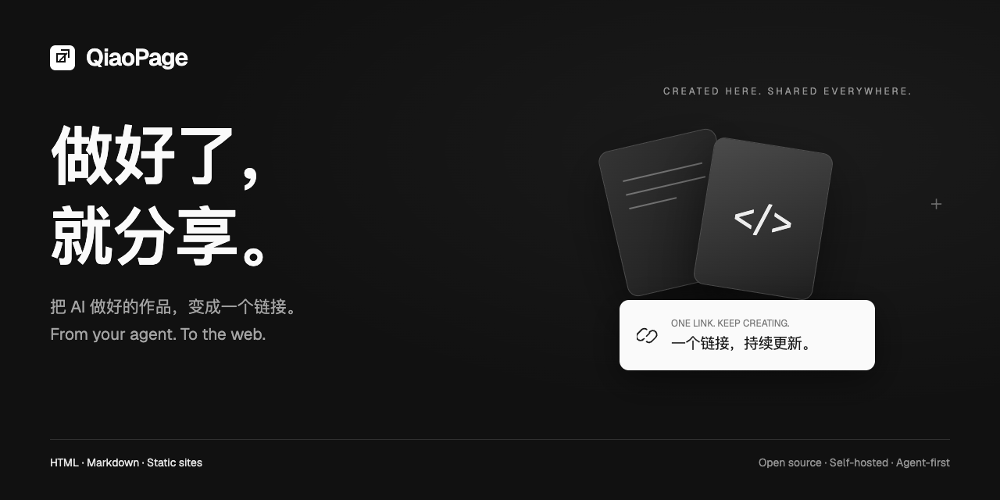
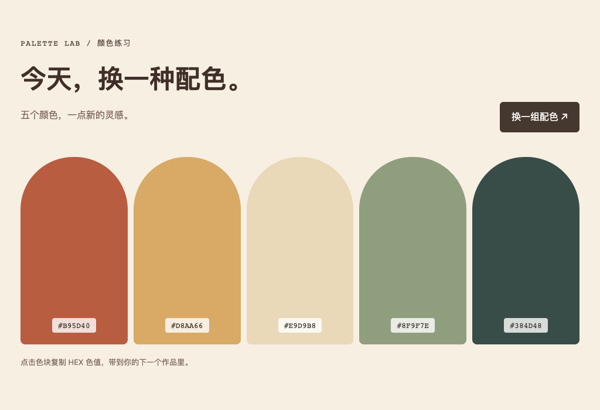
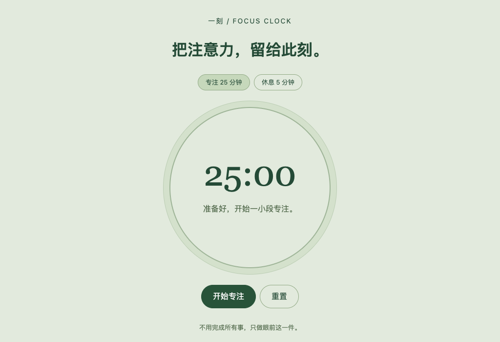
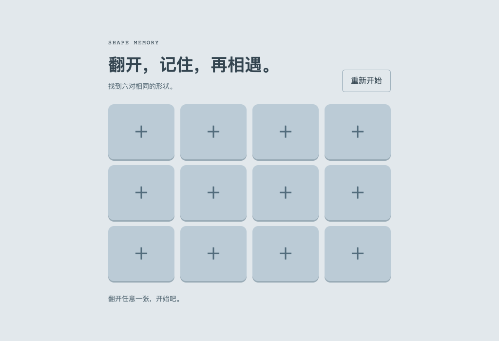
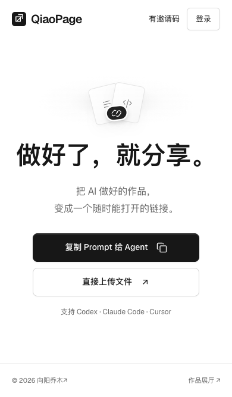
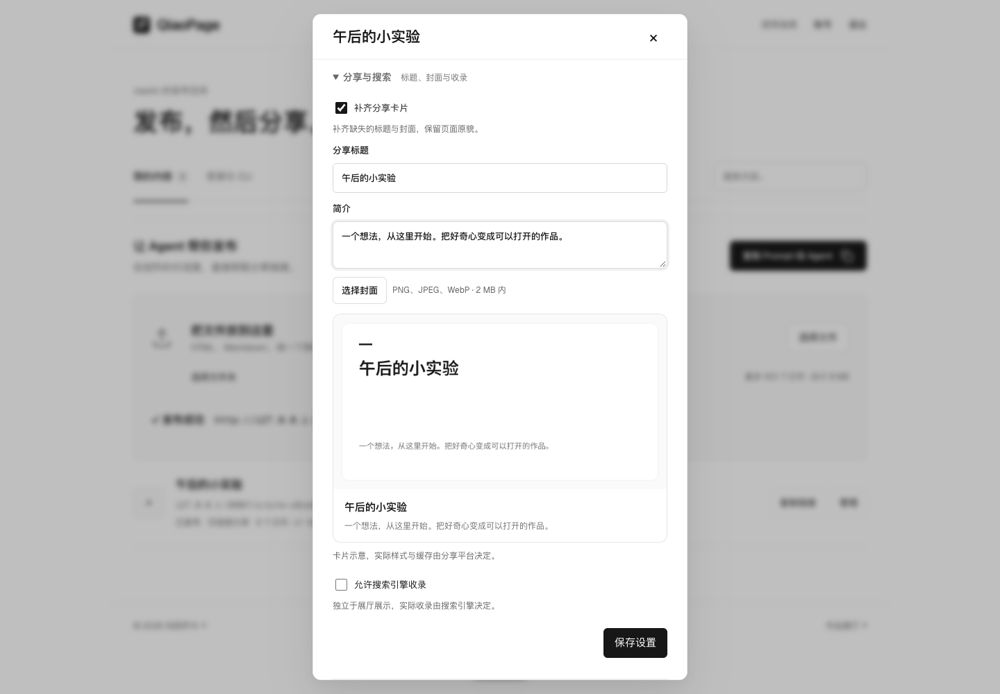
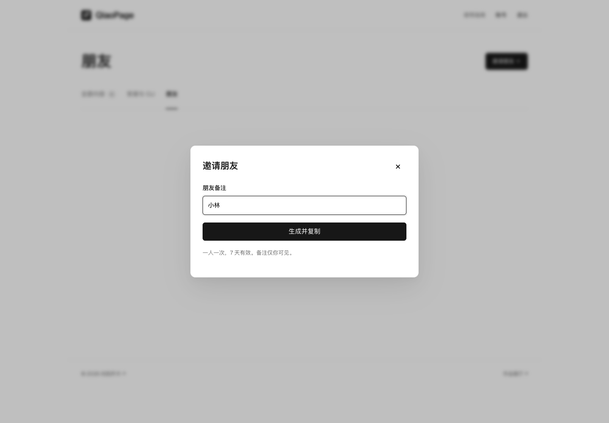
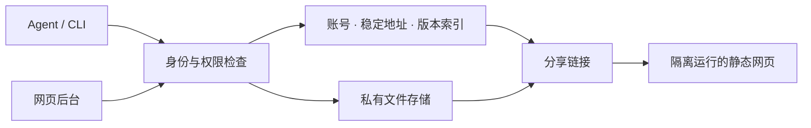

<div align="center">

# QiaoPage · 乔木发布

**做好了，就分享。**

让 AI 做好的网页，有一个随时能打开、持续能更新的链接。<br>
**From your agent. To the web.**

**中文** · [English](README.en.md)

[体验首页 ↗](https://quickshare-agent-test.vercel.app) · [玩一个真实作品](https://quickshare-agent-test.vercel.app/s/site-jqutfay8tx/) · [自己部署](#快速开始) · [Agent 接入](#把发布留在对话里)

[](https://github.com/joeseesun/qiaopage/actions/workflows/check.yml)
[](LICENSE)
[](package.json)



**一个 Prompt 接入 · 一句话发布 · 一个链接持续更新**

</div>

## 从「做出来」到「发给朋友」

你和 AI 做了一个小工具、一份交互报告，或者一整个静态网站。最想做的下一步，是发一个链接给朋友。

QiaoPage 把这一步留在原来的对话里：**让 Agent 接上你自己的发布服务，发布文件，返回链接。** 以后说“更新刚才的网站”，朋友打开的仍是同一个地址。

给自己装一套，也能邀请朋友共用。每个人都有独立身份和自己的内容；朋友把邀请 Prompt 发给自己的 Agent 就能接入，用户名和密码可以之后再设。

> 已有实例的受邀朋友：复制邀请 Prompt 给 Agent 即可。公开演示可浏览首页和示例；发布需要管理员邀请，或部署自己的实例。

## 先玩一下

以下作品由仓库中的 HTML **原样发布**，无需登录即可体验。点击图片打开。

<table>
<tr>
<td width="33%"><a href="https://quickshare-agent-test.vercel.app/s/site-5dmzyhdc49/"></a></td>
<td width="33%"><a href="https://quickshare-agent-test.vercel.app/s/site-zgg3w7ghz2/"></a></td>
<td width="33%"><a href="https://quickshare-agent-test.vercel.app/s/site-jqutfay8tx/"></a></td>
</tr>
<tr>
<td><b>色彩实验室</b><br>把灵感调成一组配色。<br><a href="examples/palette-lab.html">查看源码</a></td>
<td><b>专注时钟</b><br>给一件事留一段时间。<br><a href="examples/focus-clock.html">查看源码</a></td>
<td><b>记忆翻牌</b><br>一个随手发给朋友的小游戏。<br><a href="examples/memory-tiles.html">查看源码</a></td>
</tr>
</table>

[更多可发布示例 →](examples/)

## 把发布留在对话里

在自己实例的首页复制 Prompt，或收到管理员发来的邀请 Prompt，粘贴给 Codex、Claude Code、Cursor 等具备命令执行能力的 Agent。它读取当前实例的 Skill，安装 CLI，连接你的发布空间，并确认账号和权限。

```text
你：把这个文件夹发布出去。
   → Agent 上传静态文件，返回分享链接。

你：改好了，更新刚才的网站，保留链接。
   → 原地址更新，旧版本可恢复。

你：分享标题改成「我的周末计划」，再加一张封面。
   → Agent 更新分享设置；你也能在网页后台修改。
```

这是可用操作的示意，具体链接由你的实例返回。首次安装只完成接入，发布哪些文件由你决定。

| 你想做什么 | QiaoPage 帮你完成 |
| --- | --- |
| 分享 AI 做好的作品 | HTML、Markdown、静态网站文件夹，上传后直接打开 |
| 一直用同一个链接 | 自动分配带随机短码的地址；改标题、改账号、更新内容都保留 URL |
| 放心继续改 | 重试不重复建站，版本冲突检查，历史恢复、下架与重新发布 |
| 让朋友一起用 | 一人一份邀请 Prompt、独立身份、独立空间；管理员可备注和停用 |
| 让分享卡片更好看 | 按需设置 OG 标题、摘要和封面，按需开启搜索收录 |
| 在对话里管理账号 | Agent 查看自身身份、权限和配额，按请求修改用户名与密码 |
| 掌握自己的数据 | Docker / VPS / Cloudflare / Vercel，私有存储，可备份与恢复 |

**发布的是什么，打开的就是什么。** 默认保留原始 HTML，不加水印、平台署名或推广。分享增强与搜索收录由作者主动开启，已有网页元信息优先。

## 网页端，同样顺手

不想输入命令，也能直接上传、更新作品、恢复版本和管理朋友。

<table>
<tr>
<td width="72%"></td>
<td width="28%"></td>
</tr>
</table>

<details>
<summary><b>看看分享设置与朋友邀请</b></summary>





截图来自隔离的演示数据，实际界面截图由浏览器验收脚本生成。

</details>

## 快速开始

### 推荐：Docker，自有数据，一套跑起来

需要 Docker 与 Compose v2；无需在宿主机安装 Node.js。首次构建时间取决于网络和设备。

```sh
git clone https://github.com/joeseesun/qiaopage.git
cd qiaopage

docker run --rm --user "$(id -u):$(id -g)" \
  -v "$PWD:/workspace" -w /workspace \
  node:24.20.0-bookworm-slim node scripts/setup.js --docker

docker compose --env-file .env.docker up -d --build --wait
```

打开 **http://127.0.0.1:8090**。然后获取五分钟有效、仅可使用一次的管理员登录链接：

```sh
docker compose --env-file .env.docker exec -T quickshare \
  node bin/quickshare.js dashboard --url http://127.0.0.1:3000
```

登录后即可发布作品、设置账号或邀请朋友。**没有通用默认密码**；随机管理员密钥保存在本机 `.env.docker`，请私密保存。公网使用需配置 HTTPS 与对应 `BASE_URL`。

[完整 Docker 指南 →](DOCKER_INSTALL.md)

### Cloudflare / Vercel：用官方 CLI 安装

克隆仓库后，使用 Node.js 24+ 安装依赖，选择一个平台执行：

```sh
npm ci --ignore-scripts

# Cloudflare Workers + Durable Objects + R2
npm run install:cloudflare -- qiaopage

# 或：Vercel + Turso + 私有 Blob
npm run install:vercel -- qiaopage
```

安装脚本创建或复用资源、生成并保存管理员密钥，完成后输出访问地址。需要你自己的平台账号；首次登录、服务条款和可能涉及的计费开通由本人确认。`qiaopage` 可换成自己的项目名；已有安装升级时沿用原名。

这是**已实测的 CLI 安装**。浏览器一键部署按钮尚未验收，不作为当前可用入口。

[云端安装、管理员登录与恢复 →](docs/cloud-install.md)

<details>
<summary>本地开发：Node.js 24+</summary>

```sh
npm ci
npm run setup
npm start
```

访问 http://127.0.0.1:3000。另开终端运行 `node bin/quickshare.js dashboard` 获取本地管理员登录链接。`.env` 和 Docker 的 `.env.docker` 独立保存。

</details>

### 已连接 Agent？CLI 也能独立用

下面的 `quickshare.js` 指实例提供的独立 CLI 文件，使用 Agent 安装时记录的路径：

```sh
node quickshare.js whoami --json
node quickshare.js publish ./dist
node quickshare.js update RETURNED_SLUG ./dist
node quickshare.js list --json
node quickshare.js versions RETURNED_SLUG
node quickshare.js account --json
```

`RETURNED_SLUG` 用发布时返回的实际值替换。未配置实例地址时，CLI 会停止并提示登录，不会连接到别人的服务。QiaoPage 保留 `quickshare` CLI、`qiaomu-quickshare` Skill 与旧配置标识，已有连接无需重建。见[品牌与兼容性](docs/branding.md)。

## 数据放在哪里

| 部署方式 | 数据库 | 文件存储 | 验证范围 |
| --- | --- | --- | --- |
| Docker / VPS | SQLite 或 libSQL | 持久目录 / 私有 S3 | 容器安装、发布、重建保留数据；libSQL + MinIO 集成测试 |
| Cloudflare Workers | SQLite Durable Object | 私有 R2 | 官方 CLI 部署、满尺寸上传、重部署保留数据、PITR 恢复 |
| Vercel | Turso / libSQL | 私有 Vercel Blob | 官方 CLI 部署、网页分块上传、重部署保留数据、导出恢复 |



文件先写入不可变对象，再用事务更新索引。分享链接经过发布状态检查，用户 HTML 运行于独立的 opaque sandbox。网页会话与 Agent 使用不同的凭据机制，普通成员只能管理自己的内容。

[架构说明](docs/portable-deployment.md) · [存储与迁移](docs/storage.md) · [安全策略](SECURITY.md)

## 使用前了解这些

- **静态发布**：不运行后端 Node、Python、PHP，也不托管数据库型应用。前端项目先构建，再上传静态产物。
- **内容大小**：每次最多 100 个文件 / 8 MiB，单文件最多 5 MiB，每位成员最多 100 个站点。大文件自动分块上传。
- **链接可见性**：默认不进入展厅，但任何拿到链接的人都能访问。不要把它当作私密文档权限系统。
- **网页隔离**：不开放管理站 Cookie / localStorage、Service Worker；静态资源建议使用相对路径。
- **运行成本**：开源代码使用 ISC 许可；云平台、域名与存储费用由部署者承担，免费额度以各平台当前规则为准。
- **发布形态**：目前从源码安装，尚未提供预构建容器镜像。默认 SQLite 使用单实例和持久卷。

<details>
<summary>常见问题</summary>

**朋友一定要注册吗？** 不需要先填账号密码。每份邀请对应独立身份，Agent 接入后就能发布，之后可补设账号。邀请一次有效，请为每位朋友单独生成。

**为什么新名字还在用 quickshare 命令？** 为兼容已有实例、Agent 技能和私密配置。产品品牌与存储、协议标识分开演进。

**提示没有配置服务地址？** 使用你自己实例的首页 Prompt 接入，或查看 `node quickshare.js login --help`。不要把管理员密钥发给朋友。

**更新后链接会变吗？** 使用 `update` 更新原站点，地址不变。重新执行 `publish` 发布修改后的文件代表创建另一个站点。

**能替代通用应用托管吗？** 当前面向个人和朋友分享静态作品。需要服务器代码、登录型前端存储或更大文件时，应选择匹配该需求的部署方式。

</details>

## 开发与贡献

欢迎安装反馈、可复现的 Bug 和聚焦的小范围 PR。读[贡献指南](CONTRIBUTING.md)、[行为准则](CODE_OF_CONDUCT.md)；安全问题请走[私密报告](https://github.com/joeseesun/qiaopage/security/advisories/new)。

```sh
npm run check
npm test
npm run verify:ui          # 需要 Chrome
npm run verify:docker     # 需要 Docker
npm run verify:backends   # libSQL + MinIO 集成验收
npm run verify:cloudflare # 本地原生 Workers 验收
```

当前发布通过 56 项自动化测试与桌面 / 390px 浏览器验收。CI 持续验证 Node、Docker、libSQL / S3 与 Workers；实际云部署和恢复记录见[验收范围](docs/verification.md)。

<details>
<summary>代码导览</summary>

| 目录 | 用途 |
| --- | --- |
| `server.js` / `lib/` | 发布 API、账号、权限、存储与分享设置 |
| `views/` / `public/showcase/` | 网页首页、后台与作品展厅 |
| `bin/quickshare.js` / `lib/agent.js` | 独立 CLI 与实例生成的 Agent Skill |
| `cloudflare/` / `vercel/` | 云平台运行时 |
| `scripts/` / `test/` | 安装、备份、迁移与验收 |
| `examples/` | 可直接发布的静态作品 |

</details>

下一步：浏览器部署按钮验收、预构建容器镜像，以及更顺手的首次部署体验。这些是计划，尚未作为已交付能力提供。

## 来源与作者

QiaoPage 从 [Quickshare](https://github.com/joeseesun/quickshare) 演进而来，专注于 Agent 发布与可自行安装的服务。交互理念受到 [here.now](https://here.now/) 启发。沿用 **ISC** 代码许可，Geist 与 Noto Sans SC 字体遵循各自的 SIL OFL；详见 [LICENSE](LICENSE) 与 [NOTICE](NOTICE.md)。

由 **[向阳乔木](https://x.com/vista8)** 制作和维护。把 AI 做成能真正用上的工具。

[个人网站](https://qiaomu.ai) · [博客](https://blog.qiaomu.ai) · [乔木推荐](https://tuijian.qiaomu.ai) · [X @vista8](https://x.com/vista8) · [GitHub](https://github.com/joeseesun/)<br>
微信公众号：向阳乔木推荐看
